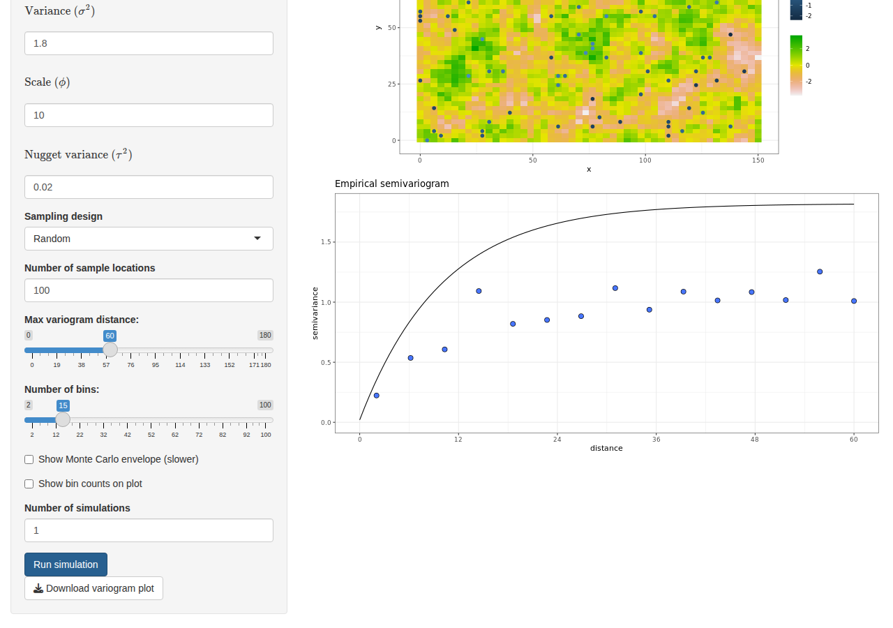

<!-- README.md is generated from README.Rmd. Please edit that file -->

```{r, include = FALSE}
knitr::opts_chunk$set(
  collapse = TRUE,
  comment = "#>",
  fig.path = "man/figures/README-",
  out.width = "100%"
)
```

# variogramApp

<!-- badges: start -->
[](https://github.com/olatunjijohnson/variogramApp/actions)
<!-- badges: end -->

An interactive Shiny app for teaching and exploring **variograms** and
**Gaussian random fields**. Designed for statistics courses and workshops —
no R installation needed for students.

---

## Try it now

<table>
<tr>
<td width="200px" align="center">

<br/>
<sub>Scan to open on any device</sub>
</td>
<td>

**Live app:** https://olatunjijohnson-variogramapp.hf.space

Students can open this URL in any browser — phone, tablet, or laptop.
No R, no installation, no login required.

</td>
</tr>
</table>

---

## Screenshot



*Exponential model: 2D Gaussian random field (top) with 100 random sample
locations (dots) and the resulting empirical semivariogram vs. theoretical
curve (bottom).*

---

## What the app does

The app lets you simulate a Gaussian random field, draw a sample from it,
and see how well the empirical variogram recovers the true covariance
structure. It is designed to build intuition about:

- How covariance model parameters (variance, scale, nugget, smoothness)
  shape the variogram
- How sample size and spatial design affect estimation
- What Monte Carlo permutation envelopes mean in practice

### Features

| Feature | Description |
|---|---|
| 12 covariance models | Matérn, Exponential, Gaussian, Spherical, Circular, Cubic, Wave, Power, Powered Exponential, Cauchy, Gneiting, Pure Nugget |
| Live formula display | The mathematical formula for the selected model updates in real time with MathJax rendering |
| 1D and 2D simulation | 1D produces a time-series; 2D produces a spatial raster map |
| Sampling designs | Random sampling or inhibitory (minimum-distance) sampling |
| Empirical semivariogram | Plotted against the true theoretical curve |
| Monte Carlo envelope | Permutation-based 95% significance band (toggle on/off) |
| Bin counts | Number of pairs per bin shown on the plot (toggle on/off) |
| Multiple simulations | Run N realisations and animate through them with a slider |
| Download | Save the variogram plot as a PNG |

---

## Controls explained

| Control | What it does |
|---|---|
| **Covariance model** | Selects the covariance function used to simulate the field |
| **Dimension** | 1D (time series) or 2D (spatial map) |
| **Domain** | Size of the simulation grid |
| **Variance σ²** | Marginal variance of the process (controls the sill) |
| **Scale φ** | Range parameter — larger values = stronger spatial correlation over longer distances |
| **Nugget τ²** | Micro-scale noise added to each observation |
| **Smoothness κ** | (Matérn / Powered Exponential / Cauchy only) Controls how smooth the field is |
| **Sampling design** | Random: locations drawn uniformly. Inhibitory: locations kept at least `delta` apart |
| **Min distance** | Minimum gap between sample locations in inhibitory sampling |
| **Sample locations** | Number of points sampled from the simulated field |
| **Max variogram distance** | Upper limit on the x-axis of the variogram plot |
| **Number of bins** | How many distance classes the variogram is divided into |
| **MC envelope** | Toggle a 95% permutation envelope (slower — reduce sample size first) |
| **Bin counts** | Show the number of pairs contributing to each bin |
| **Number of simulations** | Simulate multiple realisations; animate with the slider |

---

## Installation

### Option 1 — Use the hosted app (recommended for students)

Open **https://olatunjijohnson-variogramapp.hf.space** in any browser.
No R required.

### Option 2 — Install the R package

```r
# install.packages("remotes")
remotes::install_github("olatunjijohnson/variogramApp")
```

Then launch with:

```r
library(variogramApp)
run_variog_app()
```

### Option 3 — Run directly without installing

Requires R with `shiny`, `geoR`, `ggplot2`, and `dplyr` installed:

```r
# install.packages(c("shiny", "geoR", "ggplot2", "dplyr"))
shiny::runGitHub(
  repo     = "variogramApp",
  username = "olatunjijohnson",
  subdir   = "inst/variogramApp"
)
```

---

## For instructors

### Sharing with students

The quickest way is to share the URL or display the QR code on a slide:

```r
# install.packages("qrcode")
library(qrcode)
png("variogramApp_qr.png", width = 400, height = 400)
plot(qr_code("https://olatunjijohnson-variogramapp.hf.space"))
dev.off()
```

### Hosting your own copy

If you need your own instance (e.g. for a high-traffic class session),
deploy to [Hugging Face Spaces](https://huggingface.co) for free.

All deployment files are in `deploy/huggingface/` in this repository.

**Step 1** — Create a free account at huggingface.co, then create a new
Space with **SDK: Docker** and **Visibility: Public**.

**Step 2** — Clone your new Space and copy the deployment files in:

```bash
git clone https://huggingface.co/spaces/YOUR_USERNAME/variogramApp
cd variogramApp
# copy deploy/huggingface/* from this repo into the cloned Space folder
git add .
git commit -m "Deploy variogramApp"
git push
```

**Step 3** — Wait ~3 minutes for the build. Your app will be live at
`https://YOUR_USERNAME-variogramapp.hf.space`.

### Tips for classroom use

- Keep **Number of sample locations** at 100 or below for fast simulations on
  the hosted server
- The **Monte Carlo envelope** can take 1–2 minutes with 100 samples — warn
  students before they enable it, or reduce samples to 50 first
- Use **Number of simulations > 1** with the animation slider to show students
  how the empirical variogram varies across realisations of the same process —
  this is one of the most effective teaching uses of the app

---

## Dependencies

| Package | Role |
|---------|------|
| `shiny` | Web application framework |
| `geoR` | Variogram computation and Gaussian random field simulation |
| `ggplot2` | All plots |
| `dplyr` | Data manipulation |

---

## Citation

If you use this app in teaching or research, please cite:

> Johnson, O. (2021). *variogramApp: An interactive Shiny application for
> exploring variograms and Gaussian random fields* (v0.2.0).
> https://github.com/olatunjijohnson/variogramApp
